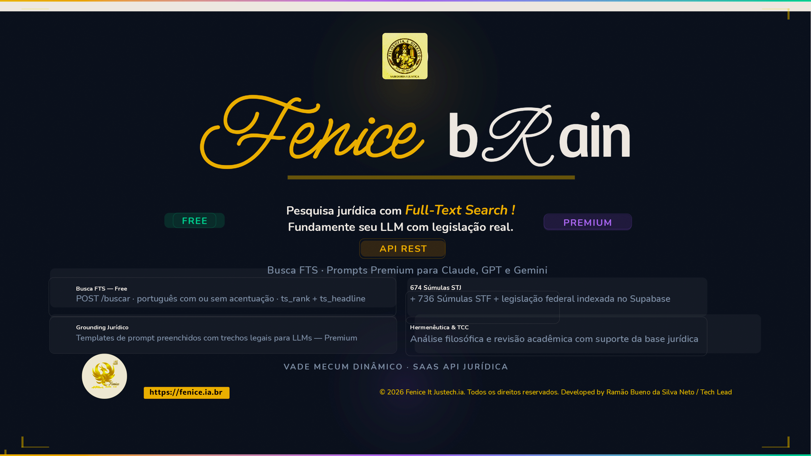

<div align="center">



# Fenice bRain

**Plataforma jurídica inteligente · SAAS API Jurídica · Vault de Conhecimento**

[fenice.ia.br](https://fenice.ia.br) · [Observatório da Mulher](https://observatorio-da-mulher-sfs.com.br)

*© 2026 Fenice IT Justech.ia · Todos os direitos reservados · Developed by Ramão Bueno da Silva Neto / Tech Lead*

</div>

---

## Projetos em Produção

| Projeto | URL | Vercel App | Stack |
|---|---|---|---|
| Fenice.ia.br | [fenice.ia.br](https://fenice.ia.br) | `fenice-justech` | FastAPI + Python |
| Observatório da Mulher | [observatorio-da-mulher-sfs.com.br](https://observatorio-da-mulher-sfs.com.br) | `violencia-mulher-sfs` | Next.js 16 |

> Leia a **[Reza do Dia](REZA-DO-DIA.md)** antes de começar qualquer sessão de trabalho.
> Manual completo de infra e deploy: **[docs/INFRA-DEPLOY.md](docs/INFRA-DEPLOY.md)**

---

## Estrutura do Repositório

```
Fenice_bRain/
├── api/                       # FastAPI — backend fenice.ia.br
├── scripts/                   # Scripts Python (RAG, LLM Wiki, pipelines)
│   ├── api_fenice_saas.py     # Entry point da API + webhook WhatsApp
│   ├── fenice_rag.py          # Módulo RAG híbrido
│   └── landing.html           # Landing page fenice.ia.br
├── violencia-mulher-sfs/      # Next.js — Observatório da Mulher SFS
├── docs/                      # Documentação operacional
│   ├── INFRA-DEPLOY.md        # Manual de infraestrutura
│   ├── STACK-ANALYSIS-*.md    # Análise da stack e custos
│   └── AVISAAPI.md            # Documentação WhatsApp / AvisaAPI
├── REZA-DO-DIA.md             # Checklist e regras diárias (leia primeiro)
├── vercel.json                # Config Vercel para fenice-justech (Python)
├── .vercelignore              # Whitelist — controla o que cada app vê
└── [vault Obsidian]           # 23k+ notas jurídicas (00_APEX … 09_FENICE_BRAIN)
```

---

## Deploy Rápido

```bash
# fenice.ia.br (Python/FastAPI) — deploy manual
vercel deploy --prod

# Observatório (Next.js) — deploy automático via Git push
git add -u violencia-mulher-sfs/
git commit -m "feat(obs): ..."
git push
```

---

## Vault Jurídico — Módulos Principais

| Pasta | Conteúdo |
|---|---|
| `00_APEX/` | Súmulas STJ (674) + STF (736) indexadas no Supabase |
| `02_LEGISLACAO/` | Código Penal (665 arts), CF, legislação federal |
| `06_JURISCONSULTOS/` | Doutrina — LLM Wiki com GIGO gate |
| `07_FILOSOFIA/` | Filosofia jurídica — LLM Wiki |
| `09_FENICE_BRAIN/` | Prompts, specs, maestros, sistema acadêmico |

---

## Stack Tecnológica

- **Backend**: FastAPI · Python 3.12 · Vercel (Fluid Compute)
- **Frontend**: Next.js 16 (App Router) · React 19 · Tailwind CSS 4
- **Banco de dados**: Supabase (PostgreSQL) · REST API
- **IA**: Groq `llama-3.3-70b-versatile` · Claude API
- **WhatsApp**: AvisaAPI · webhook síncrono
- **Tipografia**: Adobe Fonts (kits `ajp1gxj`, `cmr1ivs`)
- **Vault**: Obsidian · 23k+ notas · Graph View · Quartz (site)

---

*Vault criado: 2026-06-03 · Atualizado: 2026-06-25*
